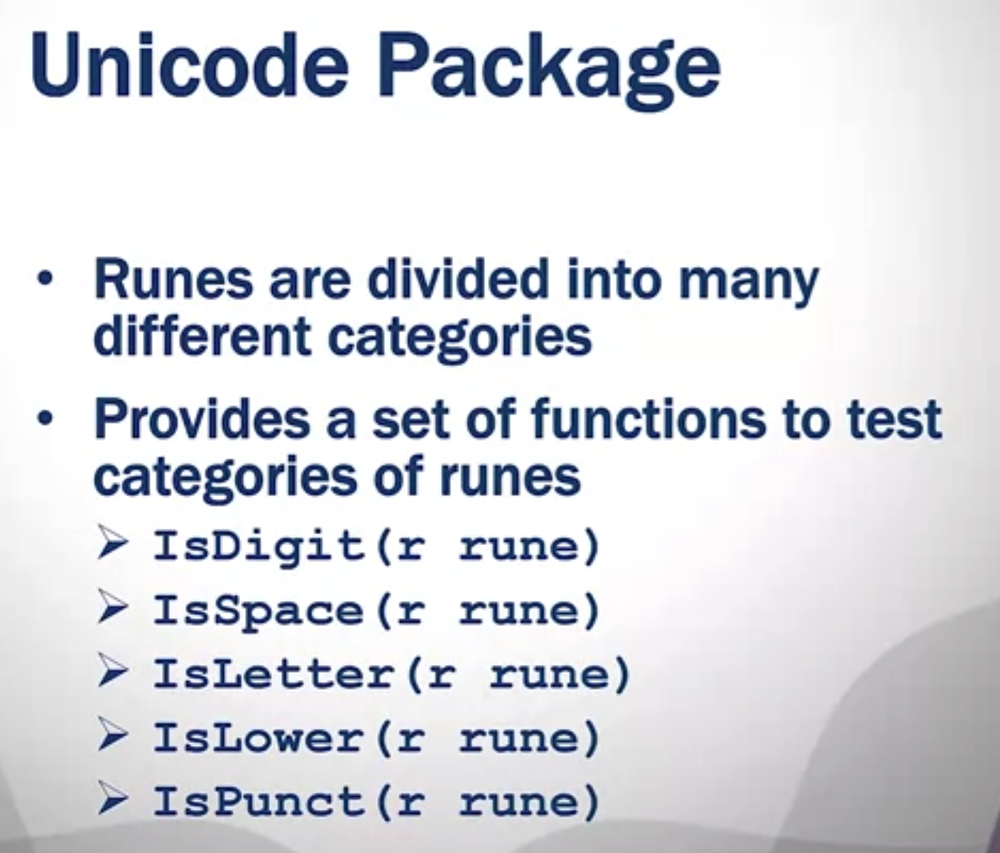

# STRING PACKAGE
Functions provided :
1. Compare(a, b string) int : returns 0 if a==b, -1 if a<b, 1 if a>b
1. Contains(s, substr string) bool : returns true if substr is present in s
2. Count(s, sep string) int : returns the number of non-overlapping instances of sep in s(non-overlapping means if sep is present in s multiple times, it will be counted only once)
3. HasPrefix(s, prefix string) bool : returns true if s has prefix(meaning s starts with prefix)
4. HasSuffix(s, suffix string) bool : returns true if s has suffix(meaning s ends with suffix)
5. Index(s, substr string) int : returns the index of substr in s
6. Join(a []string, sep string) string : joins the elements of a to create a single string with separator sep
7. Repeat(s string, count int) string : returns a new string consisting of count copies of s(eg : Repeat("abc", 3) = "abcabcabc")
8. Replace(s, old, new string, n int) string : replaces old with new in s (new string, no modification as strings are immutable) : n is the number of replacements to be made, if n=-1, all occurences will be replaced
9. Split(s, sep string) []string : splits s into substrings separated by sep and returns a slice of the substrings
10. ToLower(s string) string : returns lowercase of s
11. ToUpper(s string) string : returns uppercase of s
12. Trim(s string, cutset string) string : removes leading and trailing characters in cutset from s( eg : Trim("abc", "a") = "bc")
13. TrimSpace(s string) string : removes leading and trailing spaces
13. TrimLeft(s string, cutset string) string : removes leading characters in cutset from s( eg : TrimLeft("abc", "a") = "bc")
14. TrimRight(s string, cutset string) string : removes trailing characters in cutset from s( eg : TrimRight("abc", "c") = "ab")
15. Fields(s string) []string : splits s into substrings separated by spaces, tabs, newlines and returns a slice of the substrings
16. ToTitle(s string) string : returns a copy of s with all Unicode letters mapped to their title case
17. ToTitleSpecial(c unicode.SpecialCase, s string) string : returns a copy of s with all Unicode letters mapped to their title case, using the case mapping specified by c

# STRCONV PACKAGE
Functions provided :
1. Atoi(s string) (int, error) : converts string to int if string represents an integer, if not returns error
2. Itoa(i int) string : converts int(base10) to string 
3. FormatFloat(f float64, fmt byte, prec, bitSize int) string : converts float to string
4. ParseFloat(s string, bitSize int) (float64, error) : converts string to float